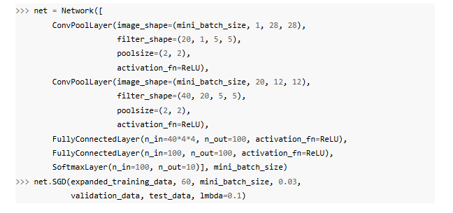

# MNIST Image Classification with a Convolutional Neural Network

https://en.wikipedia.org/wiki/MNIST_database

http://neuralnetworksanddeeplearning.com/chap6.html

## Implementing the Architecture from the book

Network Architecture

- create the architecture above
	- Conv Layers - convolutional + max pooling
		- image_shape = batch size, number of feature maps input, image size
		- filter_shape = number of filters, number of input feature maps, heigh and width
			- local receptive field size
		- poolsize = y, x pooling sizes
- apply dropout to fully connected layers (p=0.5)
- regularized log-likelihood cost function
- 60 epochs, learning_rate = 0.03, lambda (regularizaiotn param) = 0.1
- expand the training data