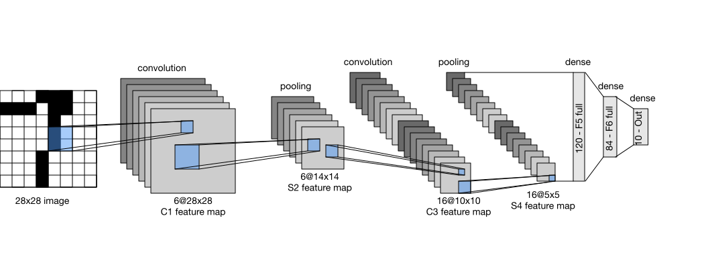

# Data Pruning - MNIST Image Classification

# Goal
How far can we reduce the size of MNIST dataset and still get "good" performance?

Let's say good is 95% accuracy or better.

# Set Up

The baseline model will be LeNet-5.

Train on the full 60,000 MNIST training images, test on the standard 10,000 images.

Final test accuracy expected ~98–99%.

# Results
Baseline, full dataset: 99%

Pruning
Keep Random 50%: 98.93%
Keep Random 10%: 97.20%
Keep Random 1% : 90.69%

# Resources

## LetNet-5
http://vision.stanford.edu/cs598_spring07/papers/Lecun98.pdf
https://en.wikipedia.org/wiki/LeNet
https://www.digitalocean.com/community/tutorials/writing-lenet5-from-scratch-in-python

## MNIST Problem
https://en.wikipedia.org/wiki/MNIST_database

http://neuralnetworksanddeeplearning.com/chap1.html

## Data Pruning
[Beyond Neural Scaling Laws](../../notes/papers/beyond%20neural%20scaling%20laws.md)
