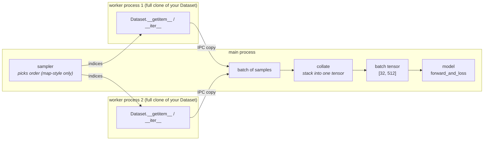
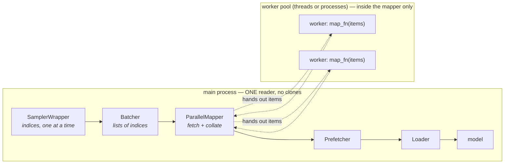

# The Dataloading Map — shared diagram for both videos

One drawing, two states. Draw state A for video 1, then video 2 opens with state A
and explodes the middle box into state B. Same map is the thumbnail system
(highlight a different region per video).

The layer that makes both videos land: **process boundaries** (dashed boxes) —
*who runs your code where* is the real difference between DataLoader and nodes.

## State A — the classic DataLoader (video 1)

Talking points on this drawing:

- **Left side is yours** (the Dataset contract: map = `__len__`+`__getitem__`, iterable = `__iter__`);
  the rest is DataLoader machinery.
- With **map-style**, the sampler splits *indices* across workers — each sample fetched once.
- With **iterable**, there are no indices — the sampler arrow disappears, each worker clone runs
  the *whole* iterator → duplication unless you shard by hand (`get_worker_info`).
- Each dashed worker box = a **full copy of your dataset's memory** (copy-on-read) + an **IPC copy**
  on the way back. That's the cost that motivates video 2.

Hand-draw notes: the two worker boxes should look like *photocopies of each other*
(that's the joke and the point). For the iterable case, redraw with the sampler crossed out
and identical samples flowing from both clones.

## State B — the same machine, unbundled into nodes (video 2)

Talking points:

- **Each box was one argument to DataLoader** (`shuffle` → SamplerWrapper+RandomSampler,
  `batch_size`/`drop_last` → Batcher, `num_workers` → ParallelMapper, prefetching → Prefetcher).
  Point at the line of code, then at the box: "that line IS this box."
- Parallelism moved from *cloning the reader* (state A's photocopied boxes) to
  *farming out items* inside one box. No clone → nothing to shard → `get_worker_info` gone.
- Every box carries `next() / get_state() / reset()` → the whole chain has a `state_dict()`.
  Draw a bookmark/ribbon hanging off the chain: mid-epoch checkpoint.
- For the infinite stream, replace SamplerWrapper+Batcher's front with `SeriesStreamNode`
  (state = one integer) — same downstream chain.

## Thumbnail system

Same map, three crops: video 1 highlights the **left** (Dataset contracts),
video 2 highlights the **middle** (exploded machinery), future bytes-to-tensor video
highlights the **arrows themselves** (where data physically lives / gets copied).
