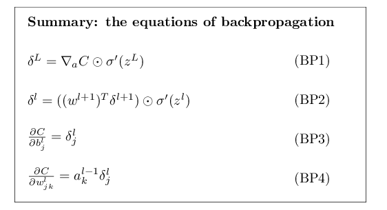

# Notes from Neural Networks and Deep Learning
[http://neuralnetworksanddeeplearning.com/](http://neuralnetworksanddeeplearning.com/)

# intro

This book about core principles of neural networks 

Don’t stress the math in chapter 2

Definitely do the exercises as a sanity check I understand 

Skip the problems- use them as inspiration for my own neural network project (something on financial or time series data).

# Chapter 1 - basic NN

### My Notes
Gradient descent is our learning algorithm, our cost function or objective function. It seeks to find the direction to make a small change of the weights and biases to minimize the cost.
The cost being how off the output layer was from the desired result.

Feedforward NN mean data keeps moving forward never looping back,
Recurrent NN has data that can later loop back but not instantaneously.

Designing your network is a bit of art like how many hidden layers to trade off training time and accuracy. And how many output or what the output is.

Deep learning are neural networks with more than one hidden layer. Concepts or sub networks are basically decomposing the problem into sub problems at each layer. That’s how deep nets break down problems.

Deep networks use different newer learning techniques.


### My Highlights from reading
- neural networks -> learn to solve problems, they don't need explicit instructions on how to solve the problem
- stochastic gradient descent as the learning algorithm
- bitwise == binary representation of a number

##### perceptron neurons
- perceptron neurons (1950s) - binary 0 or 1
	- output = sum(weights * inputs) > threshold
	- its a device that makes decisions by weighing up evidence
	- a perceptron in second layer of network is making a decision at a more complex and abstract level
	- bias = threshold, its a measure of how easy it is to get that perceptron to "fire"
	- perceptions can compute any logical function

##### sigmoid neurons
- sigmoid neuron - 0 to 1 continuous
	- learning - the goal is to make small changes in the parameters (weights and bias) that produce small changes in the output. sigmoid neurons allow this b/c of their continuous nature
		- we want this b/c large jumps when learning might cause us to regress (get things wrong we were previously correct on)
	- sigmoid function (or logistic function) = really big values become 1, really negative values become 0, everything else is in between
		- it's a smooth shape between 0 and 1, rather than the discrete jump of a perceptron neuron
	- sigmoid is the "activation function" here - it can be something else

##### architecture of neural networks
- input layer (our input data) - hidden layer (not an input or output layer) - output layer
	- deep learning == more than 1 hidden layer
- art to the design of hidden layers
	- 1 trade off is the number of hidden layers vs time to train
- feedforward NN - output of 1 layers is input to the next, information only ever fed forward
- recurrent NN - loops are possible

##### Learning with gradient descent
- a cost function (loss or objective function) helps measure how close we are to our target output
	- in this example we use mean squared error
- this is used to inform how we can tweak weights and biases to get closer to the desired output
- Training algorithm purpose is to minimize the Cost function for our sets of weights and biases
	- Minimize `C(w, b)`
- We use the gradient descent algorithm
	- gradient vector relates changes to our weights in biases to changes in our cost
	- repeatdelty compute the gradient and then move in opposite direction to minimize cost
	- gradient descent = taking small steps in the direction which does the most to lower the Cost
	- find the weights and biases which minimize the cost
	- have to compute the gradients separately for each input (partial derivative)
- stochastic gradient descent - use a small sample of inputs to compute the gradient, speeds up the computation
	- m random samples into "mini-batches"
	- 1 epoch - all training examples use after continually sampling with mini-batches
- learning rate - how big of a step we take to minimize loss. do not want too big (might not converge) or too small (might take forever)
- high dimensional thinking - often not visual, but using other tools like algebraic representations

##### implementing our network
- training set - used to train the network
- validation set - used repeatedly to tune hyper parameters
- test set - used once to evaluate
- randomly initialized weights and biases in the network
- activations = sigmoid(weights * previous activations + biases)
- learning rate - size of steps when learning
	- .001 -> .01 -> .1 -> 1, etc
- epoch - one complete pass through training data
- Each Epoch
	- 1. randomly shuffle the training data
	- 2. slice into mini-batches
	- 3. for each mini batch -> gradient descent and update weights/biases
- Backprop algorithm - computes the gradient of the cost for a given training example
- no bias is used in input layer
- feedforward() - takes inputs and computes output of the network
- hyperparameters - configure the neural network and training
	- different from the parameters (weights & biases) of the network itself
	- tuning - if making a change improves things, try doing more of that
- debugging and tuning neural networks are a bit of an art
- a simple algorithm + good training data is often better than a sophisticated algorithm
- deep neural networks - have many layers compare to a single hidden layer for shallow neural networks
	- recursive decomposition into subnetworks - many layers break problems down into smaller and smaller problems or more abstract concepts

# Chapter 2 - Backpropagation

Backprop algorithm - how we find the changes to bias and weights impact the cost function 
- partial derivative of the cost function with respect to any weight or bias
- this tells us how quickly the cost changes when we change weights or bias
- first need to compute the error in a given layer

Partial derivative of weights and bias - computing the gradient of the cost function

Error is the small change 


### 4 equations of backprop
- together they give a way to compute the error at a given layer and the gradient of the cost function



Image taken from the book directly [here](http://neuralnetworksanddeeplearning.com/chap2.html)


##### error in the output layer (BP1)


partial derivative of the cost with resepct to activation at jth output neuron

##### error in terms of error in next layer (BP2)


error of layer l

Transpose weight matrix to move the error backward through the network

sigmoid of z -> becomes flat when really small or really large, it learns "slowly" as it's alrady close to 0 or 1 activation. said to be "saturated" and stops learning

As the error gets small, the neuron is near saturation, it will learn more slowly


Using the above two equations - can compute the error for ANY LAYER in the network.

first get error in the output layer, then use second equation to get error in output layer -1, etc.


##### rate of change of the cost with respect to any bias (BP3)

the error is equal to the rate of change here (since bias is a constant?)

##### rate of change of the cost with respect to any weight in the network (BP4)

in other words the rate of change in cost for a given weights = the activations in previous layer (the input to the weights) * error in the current layer

weights output from low-activation neurons learn slowly

### The backpropagation algorithm
- computing the gradient of the cost function
- error vectors are first computed at the last (aka output) layer
- it computes the gradient of the cost function for a single training example

Algorithm for single example
1. Set the input layer
2. Feedforward: compute activations for each layer
3. Output Error: compute the error vector
4. Backpropagate the error: for each layer compute the error at that layer
5. Return the gradient of the cost fucntion

in practice we compute the gradient for many training examples like in stochastic gradient descent - given a mini-batch of m examples

Algorithm for batches
outer loop generates mini-batches of training data
1. input training examples
2. For each training example
	1. set input
	2. feedforward and save activations at each layer
	3. compute final output layer error
	4. backpropagate error -computing error at each layer
3. for each layer update weights and biases with gradient descent average over the batch


### Is backpropagation a fast algorithm?
It just needs one forward pass and one backward pass through the network to compute the gradient.

The computational efficiency here enabled neural networks to be used at other problems (seems to be a trend, that as we get more data, more compute/more efficiency -> networks get more powerful/useful)

We can also compute gradients for other layers in parallel? 


### Backprop the big picture
Changing a single weight in one layer -> will change the activation of the connected neuron in the next layer -> which has an impact on ALL the activations in the following layer (since that neuron is connected to all neurons in next layer)

So one tiny weight change in layer 1 can have ripple effects throughout the rest of the network

Backprop is basically the method that tracks how tiny changes to weights and biases propagate through the network to reach the output and impact the cost function


# Chapter 3 - Improving the way neural networks learn

Backprop is our vanilla/ basic algorithm

This chapter teaches
- a better cost function: cross-entropy
- regularization methods: L1, L2, dropout, artificial expansion
	- these help our networks generalize beyond the training data
- better method for initializing weights
- heuristics to choose good hyper-parameteres

### Cross-Entropy Cost Function
- We want things to learn faster when more wrong
- slow learning is really the same as having small partial derivatives of our cost function
- the graph of our sigmoid function - is an S, when close to 1 or 0 or curve is very flat
	- looking for a cost function that eliminates derivative of sigmoid to avoid these slow learning periods

Cross-entropy as a cost function addresses this slow down in learning.


n= total number of training samples


Properties of Cross-entropy
- it's non-negative
- if neuron output is close to desired output for all inputs, cross entropy is close to 0
- and it avoids the problem of learning slow down

Partial derivative of cross-entropy cost w.r.t. weights.
- the rate at which our weights learn is controlled by the error in the output (sigmoid z - y)

Partial derivative of cost w.r.t. bias


- cross entropy helps us learn faster when our neuron is very wrong
- cross entropy almost always better choice when using ouput sigmoid neurons - since starting with random weights, if we are really wrong and close to 0 or 1, we can learn fast when really wrong now
- neuron saturation is an important problem in neural networks (when its heavily 1 or 0)
	- it causes this learning slowdown when using a quadratic cost function


Cross-entropy is a measure of surprise. How surprised we are (on average) when we learn the true output value.


##### Softmax
Softmax layers of neurons - another approach to address the problem of learning slowdown.
- defines a new type of output layer
- sum of the output activations are guaranteed to sum to 1

The output from softmax are a probability distribution

Use with a log-likelihood cost function.

Softmax + log-likelihood cost = whenever you want to interpret output activations as probabilities


### Overfitting and regularization
- too many free parameters -> too much freedom for a model and eventually it can describe anything without being useful to generalize
- signs of overfitting 
	- cost on training goes down while cost on validation data goes up
	- accuracy on the training data is too high (gap between train and test is wide)
	- accuracy improves and then hits a wall
- need way of detecting overfitting so not to overtrain
	- compute accraucy on validation data each epoch, if saturated - stop training
- More data often helps in preventing overfitting

##### Regularization

- regularization techniques help reduce overfitting without shrinking the network or getting more data
- L2 (weight decay) regularization
	- adds an extra term to the cost function
- regularization gets the network to prefer small weights
	- a balance between minimizing original cost function and finding small weights
	- when regularization parameter is small - prefer original cost function, when high prefer small weights


Regularized Cross-Entropy
(The regularization term is the last part)
regularization parameter / 2n  *  the sum of all the weights squared


- The more samples (the bigger the n) - the bigger weight decay (regularization param) to use.
- L2 regularization works b/c with out it - over time the weight vector can get large which makes gradient descent have a harder time changing it's direction (with tiny steps) - so we get stuck pointing the weight vector in the same direction 

##### Why does regularization help reduce overfitting
- all else equal - go for the simpler model/ explanation
- smaller weights in regularized network -> means network wont chant too much if we change some random inputs
	- makes it harder to learn "noise" in the data
	- learns from data seen across the training set
- larger weights - a network can over calibrate to noise

```
In a nutshell, regularized networks are constrained to build relatively simple models based on patterns seen often in the training data, and are resistant to learning peculiarities of the noise in the training data.
```


- sometimes though complex explanations are correct
- remember the true test of the model is how well it does in predicting on unseen data
- the human brain regularizes very well 


##### Other Techniques for Regularization
* L1 Regularization
	* different term but still shrinks the weights - but shrinks by a constant amount toward 0 (L2 shrinks by amount proportional to weight)
* Dropout
	* modifies the network itself
	* start by randomly deleting half the hidden neurons
	* then forward and back propagate
	* repeating over and over with a new random set of neurons deleted during backprop
	* gives the effect of averaging across many different networks
* Artificially increasing training set size
	* take an image of the digit and transform it in some way to get more training samples
	* operations should reflect real-world variation, not just adding noise

Some research may just be using new techniques to improve on a benchmark where the method only works on that training set (vs other/ previous techniques).


### Weight Initialization
- can we do better than just initializing with random?
- saturated hidden neurons (close to 0 or 1) will learn very slowly
- use a more narrow peak for our gaussian distribution of random weights 
	- 1 / radical(n in)
- will learn faster


### Revisiting Digit Recognition
done - L2 was a very small change to implement in the update mini batch
and then a very small change in the weights initialization


### How to choose a neural network's hyper-parameters?
- first goal on a new problem is to get ANY learning (better than chance)
	- break it down -> ie. for digit classification try to just classify 0s vs 1s
	- this gets you an easier problem AND faster iteration to experiment
- During the early stages -> goal is quick feedback from experiments
- Learning Rate
	- if too large, the gradient descent is too larger and we overshoot the minimum
	- Try 0.01, then 0.1, then 1 - looking for where learning rate causes cost to oscillate or increase after first few epochs. Then drop by factor of 10 to find where cost decreases in first few epochs.
	- trying to get an order of magnitude threshold estimate, then take roughly half of that to start
- Learning rate schedule
	- bigger step early in training, smaller step later in training
- Early stopping = number of epochs
	- compute classification accuracy on the validation data each epoch, when that stops improving then stop training
	-  A better rule is to terminate if the best classification accuracy doesn't improve for quite some time - ie. the no improvement in 10 epochs rule
- Regularization parameter, lambda
	- Start with 0.0 and find the learning rate first
	- Start lambda at 1.0 and then try up or down by factors of 10
	- Get the order of magnitude and then fine tune
	- Then re-optimize learning rate with your lambda
- Mini-batch size
	- too small and you dont take advantage of parallel compute
	- too big and you dont update weights often enough
	- pick the size that shows the fastest improvement, then optimize other params
- automated techniques like grid search
- goal - develop a workflow to iterate and experiment quickly, continually bounce back and forth as you hone in on what's working, it's not perfect

### Other Neurons
- tanh: -1 to 1, needs to normalize the data
- relu: 0 to z
- hard to tell when to use each

# Chapter 4 - visual proof that neural nets can compute any function

- universality theorem: NN can compute ANY function
	- doesn't mean we can build it
	- neural networks with a single layer can approximate any CONTINUOUS function to the DESIRED precision
- A very big weight can make z look like a step function, bias will slide the step left or right
- Assuming this - a very big weight - we can see hidden neurons as multiple step functions joined together. 
	- Weights into the output layer from hidden layer control the "height" of steps

### Many input variables
- using two inputs - can build a 3d step function as a tower
- putting different subnetworks together and modifying weights to output layer you can get many different towers

### conclusion
- universality states a neural network can compute any function
- deep networks - do a better job than shallow networks of learning complex concepts and abstractions - well enough to solve real-world problems

# Chapter 5 - why are deep neural networks hard to train
- mathematical proofs showing that for some functions very shallow circuits require exponentially more circuit elements to compute than do deep circuits
- more layers can allow us to break things down into sub-problems
- deep learning using SGD and backpropagation -> problem is different layers are learning at different speeds.

### the vanishing gradient problem
- in our current network, adding more hidden layers - the later layers will learn much faster than the early layers
- vanishing gradient problem - the gradient tends to get smaller as you move backward through the hidden layers
- the gradient in deep neural networks is _unstable_, tending to either explode or vanish in earlier layers
	- fundamental issue with gradient-based learning

### Unstable gradients in deep neural networks
- given how we initialize weights randomly with a mean 0, a weight is usually less than 1 intially. And the sigmoid prime at 0 is 1/4, so in general - most activation terms initally are pretty small and when we multiply them together (in backprop from layer to layer) they continually get smaller b/c they are less than 1
	- I'm a little fuzzy here - but it's generally in this direction
- The problem is really that the gradient in early layers is the product of the terms from all the layer layers
	- to get the layers to learn at the same speed - something needs to balance them
- Otherwise with standard gradient descent - different layers in the network will learn at different speeds

### Unstable gradients in more complex networks
- same problem, when weights aren't too large - each additional term of weight * z is making the gradient vector smaller
- large number of terms leads to instability


# Chapter 6 - deep learning
- convolutional NN
- drop-out, data augmentation
- recurrent nn
- LSTM

### Introducing convolutional networks
- initial network - all neurons were fully-connected, this doesn't take into account the spatial structure of the images
	- input pixels far apart and close together are treated the same
- CNNs: http://yann.lecun.com/exdb/publis/pdf/lecun-98.pdf

##### local receptive fields
- inputs are not a vertical line of neurons but rather a 28 x 28 square corresponding to our 28 x 28 image
- each neuron in the first hidden layer is connected to a SMALL REGION of input neurons (rather than each input neuron connecting to every hidden neuron)
- this region == local receptive field for that hidden neuron, a little window of pixels
- each local receptive field - connects to it's own hidden neuron in the first layer
- ![[Pasted image 20241030070924.png]]
	- shift over 1 pixel in this example
- The shift is called STRIDE LENGTH

#####  shared weights
- in the first layer we use the same weights and bias for each stride through the local receptive field - it's applied to every local receptive field connecting to the first hidden layer
- weights are N x N matrix that is the size of the local receptive field (5x5) in our example, but its the same weight for every stride
- This means that the neurons in the first hidden layer detect exactly the same feature just at different locations in the input image
	- "feature detector" applied over the whole image
- this map from input to hidden layer - is called a feature map
	- weights defining this feature map == shared weights
	- bias == shared bias
	- this shared weights and bias define a kernel/filter
- A complete convolutional layer has several different feature maps
	- each feature map is defined by a set of shared weights and a single shared bias
- CNNs use much fewer parameters in this first layer than a fully connected NN

##### pooling
- layers used right after convolutional layers
- takes each feature map output and prepares a condensed feature map
- takes a region (say 2x2) from convolutional layer and summarizes it 
	- max-pooling - outputs the maximum activation in the input region. a way to ask if a feature is found in the region, then it removes the positional info
	- L2 pooling - sqrt of sum(activation squares) in the region
- max-pooling applied to each feature map separately

##### putting it all together
- input neurons as a grid -> convolutional layer using a local receptive field and N feature maps -> max pooling layer applied to each feature maps, smaller region, then fully connecting the max pooled layer to output layer


### convolutional neural networks in practice

- 100 hidden neurons, 60 epochs, learning rate 0.1, mini-batch size of 10
	- 97.8 on test data - best eval epoch
- softmax + log likelihood cost function - more common for image classification
- Full Network
	- Insert convolutional layer in front of the 100 neuron hidden layer and 10 neuron output layer
	- this lets the network learn about spatial structure from the convolutional and pooling layers, while the "traditional" hidden layer is a more abstract level
- LeNet-5 - a network from the original paper
- rectified linear activation neurons seem to perform better than sigmoid activation functions
	- theory can't explain this yet (or at least in this book) - when to use what activation function
- Expand the training data - displace each image by a single pixel
- Experiments to improve performance
	- adding another fully connected hidden layer
	- using dropout on the fully connected layers
		- reduced epochs but increase neurons
	- ensemble of networks - get them to vote
- [Paper](http://arxiv.org/abs/1003.0358) - shows how really big and really deep (5 layers of 2500-500 neurons) with only data augmentation got good results. Bigger + more compute.

##### How convolutional networks help avoid instability in gradient
- convolutional layers have FEWER parameters
- regularization - like dropout helps
- rectified linear units are faster than sigmoid neurons
- GPUs enabling long training periods

TLDR: "more" training b/c it's faster helps us get past the learning instability.

Other techniques like:
- data augmentation to make the dataset larger
- better cost function to avoid learning slowdown
- good weight initialization to avoid learning slow down

Also contribute to improving our ability to learn in very large networks.


### The code for our CNNs
(I'll take notes for what to recreate in PyTorch)

Experiments
- try using dropout on the fully connected layers

FullyConnectedLayer
- good weight intialization - for a rectified linear function

ConvPoolLayer
- our convolutional layers
- creates convolutional and a max-pooling layer

SoftmaxLayer
- the output layer

Network
- some Theano specific inputs - using "symbolic outputs" to apply gradient descent

SGD
- number of mini batches
- regularized cost function
- for each epoch
	- for each mini batch
		- cost = train(mini batch)
- In this network
	- regularized log-likelihood cost function


##### PyTorch Network to Build
Network Architecture
![[Pasted image 20241105062146.png]]
- create the architecture above
	- Conv Layers - convolutional + max pooling
		- image_shape = batch size, number of feature maps input, image size
		- filter_shape = number of filters, number of input feature maps, heigh and width
			- local receptive field size
		- poolsize = y, x pooling sizes
- apply dropout to fully connected layers (p=0.5)
- regularized log-likelihood cost function
- 60 epochs, learning_rate = 0.03, lambda (regularizaiotn param) = 0.1
- expand the training data

### Recent Progress in Image Recognition
- lists several papers 2012-2014 on image recognition progress with ImageNet dataset
- (I skimmed this section given that this book is 10 years old and recent progress has changed significantly)

### Other approaches to deep neural nets
this book covered:
- stochastic gradient descent
- backpropagation
- convolutional nets
- regularization
- .. and more
But focused on the MNIST digits problem.

These foundations can hlep learn the many other topics in the field of deep learning.

##### Recurrent neural networks
We covered feedforward networks where the inputs move once through the network to determine the activations at each neuron.

Recurrent neural networks can use activations or inputs at earlier times to determine current activation of a neuron.

RNNs have some dynamic change over time.


##### Long short-term memory units (LSTMs)
RNNs hard to train initially, unstable gradient problem (gradient gets smaller and smaller as it is propagated back through the layers -> causes extremely slow learning in early layers).

In RNNs gradients are propagated back through layers & back through time.

[LSTMs introduced in 1997](http://dx.doi.org/10.1162/neco.1997.9.8.1735) - help make it easier to train RNNs.

##### Deep belief nets, generative models, and Boltzmann machines
DBN - can specify values of some features neurons and then run network backwards to generate the input.

DBNs fell out of favor b/c of the success of feedforward and recurrent neural networks.

From the author:
```
 My personal opinion is that DBNs and other generative models likely deserve more attention than they are currently receiving. And I won't be surprised if DBNs or a related model one day surpass the currently fashionable models.
```

Learn more about DBNs:
- https://www.cs.toronto.edu/~hinton/absps/guideTR.pdf
- http://www.scholarpedia.org/article/Deep_belief_networks

Interesting Paper
https://www.cs.toronto.edu/~vmnih/docs/dqn.pdf - Playing Atari with Deep Reinforcement Learning
- CNN to simplify pixel data into a simpler set of features to then play the game


### On the future of neural networks
intention-driven UI - instead of responding to users' literal queries sytems can use ML to understand what the user meant

We currently understand why NNs perform well very poorly. But again the author makes an interesting prediction that was correct:

```
I will make one prediction: I believe deep learning is here to stay. The ability to learn hierarchies of concepts, building up multiple layers of abstraction, seems to be fundamental to making sense of the world. This doesn't mean tomorrow's deep learners won't be radically different than today's. We could see major changes in the constituent units used, in the architectures, or in the learning algorithms. Those changes may be dramatic enough that we no longer think of the resulting systems as neural networks. But they'd still be doing deep learning.
```

##### NN's leading to AI?

[Conway's Law](http://en.wikipedia.org/wiki/Conway%27s_law)
```
Any organization that designs a system... will inevitably produce a design whose structure is a copy of the organization's communication structure.
```
- only those parts explicitly concerned with design and engineering
- like in medicine - as our knowledge grew, people were forced to specialize
- fields in sciecne start out with a few deep ideas - early experts can master them all but then we get deeper and there are too mayn for any one person to really master
	- so the field divides around those ideas
	- structure of our knowledge shapes the social organization of science but this shape constrains what we can discover (scientific version of Conway's law)
- Author says deep learning hasn't yet developed all it's subfields


In academic work, please cite this book as: Michael A. Nielsen, "Neural Networks and Deep Learning", Determination Press, 2015  