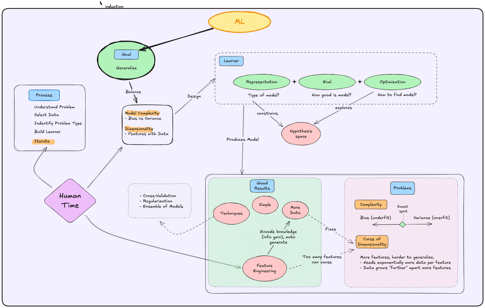

# A Few Useful Things to Know about Machine Learning

[Paper]()

# Notes
### Questions
- what is meant by hypothesis space?
	- the set of possible models given your choice of representation
- what is meant by learner?
	- the algorithm with which we select the best model?

### Notes
- representation is how you encode the model so a machine can work with it - neural network, linear, set of rules, decision tree
	- Ie family of models
- hypothesis space is the set of models you can create given your choice of learner
	- Constrained by the representation 
- learner is the representation + eval + optimizer
	- representation- family or type of model
		- Matrices of weights (NN )
		- If then rules (decision tree)
	- Eval - how you measure the model quality. Metric or objective function.
	- Optimization - how you find a good model , ie gradient descent for neural networks

Ai generated:
Example for Decision Tree Learner:
- Representation: Tree structure with if-then rules
- Evaluation: Information gain/entropy
- Optimization: Greedy search to find best splits

Example for Neural Network Learner:
- Representation: Network of weighted connections
- Evaluation: Loss function (cross-entropy, MSE)
- Optimization: Gradient descent

Learn is the factory, output is the model.
Model is the function with its tuned parameters that can take input and predict output.
##### ml flow
Understand the problem
Select data
- input- your features
- Output label
Pick the problem type
- classification, regression, clustering, dimensionality reduction, generation, reinforcement learning
Select learner
- representstikn
- eval
- Optimize
Iterate
- tune hyper parameters 
- Feature engineer

##### Model complexity
- **High Bias (Underfitting)**: how far predictions are from correct, oversimplified, fails to learn
    - Simple models that fail to capture the data’s complexity.
    - Example: A straight line trying to fit a curved trend.
    - Consequences: Poor performance on both training and test data.
    - 
- **High Variance (Overfitting)**: overly sensitive to changes in training data, fails to generalize
    - Complex models that learn noise and quirks of the training data.
    - Example: A high-degree polynomial fitting every point exactly.
    - Consequences: Great performance on training data but poor generalization to unseen data.

##### Curse of dimensionality
as you add features:
- volume of data space grows, points increasingly sparse, harder to find patterns
	- points become "further" apart
- exponentially more data required

counter act with: 
- careful feature engineering
- blessing of non- uniformity - just because the space expands doesn't mean real world data will be evenly distributed

can cause/lead to overfitting

##### Goal is to generalize
- perform well on unseen data

ML naturally amplifies patterns in the data you give it. 

Do this:
- balace model complexity (bias vs variance)
- feature engineer carefull - info gain, reduce dimensions, retain info
- have enough data
- use techniques like cross-validation, regularization to help prevent overfitting

# Initial Notes
12 ML lessons 
ML trying to represent data, then minimize a cost function, and optimize how we do it.

Theory points the way but in practice trade offs between what you can actually do 
- a lot of data but can’t access it if bottlenecks by human time
- more data good but need velocity
- More human time or faster experimentation is improtant
- Ability to compute more data too (hence transformers being a huge unlock)

Focus on simple models first, complex ones have more knobs.

Key is to learn something that generalizes out of the training set.

Inject your knowledge of the problem into the model via feature engineering and how you structure/ frame the model.